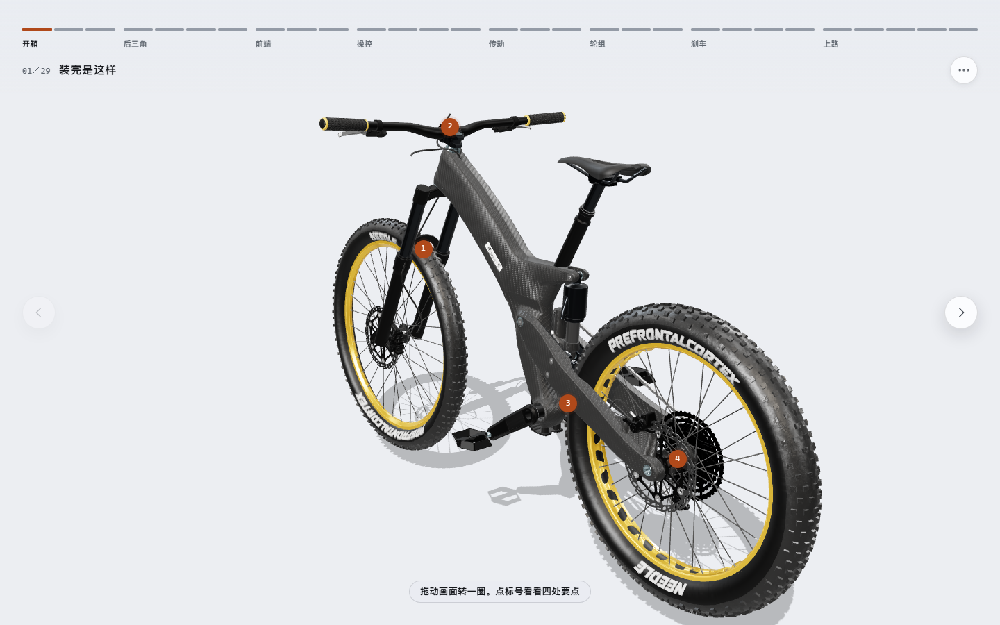
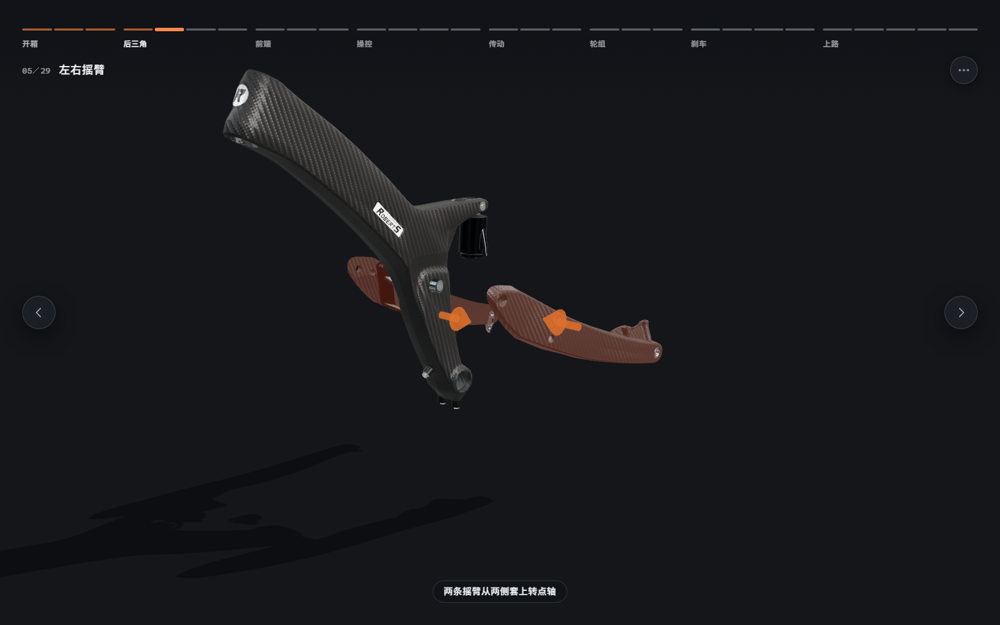
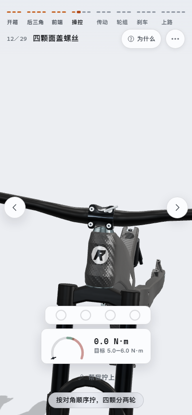

# 从零装一台车

**一台全避震山地车，从一根车架装到能骑走的三维分步说明书。**
二十七个大件、七颗要上扭矩的螺丝，八章二十九步 —— 每一件都亲眼看着装上去。

给想弄明白「一台车到底由什么组成、为什么必须这么装」的人。

**▶ 打开看看：<https://3d-bicycle.vercel.app>**

首屏要读一份 12 MB 的整车模型，第一次打开有十来秒加载条。需要 WebGL 2。



## 它是怎么讲的

**先拆开给你看。** 第二步整台车沿各自的装配方向摊开：
每一件停在它该来的那一侧，一眼看清这台车由多少东西构成。


**然后从一根车架开始，一件件长回去。** 后三角、前端、操控、传动、轮组、刹车，
顺序不是编的 —— 由清单里的 `needs` 约束，`npm run verify` 的拓扑排序替它作证：
没压头碗前叉无处可穿，没有把立车把没有托座，没装曲柄脚踏拧不进去。



**看懂优先于读懂。** 界面上常驻的文字只有两处：顶栏的步名，底部一行旁白。
其余交给动画。说明卡只出现在「物理原因看不见」的地方 ——
反牙、扭矩、对角顺序、最小插入线。

**按一下，演一件。** 「下一步」在这一步还有活没干完时先演一件，不翻页：
两条摇臂按两下，四颗面盖螺丝按四下，做完再按一下才走。
一口气演完的话，四颗螺丝会在一两秒里连着转完，
而「对角、分两轮」正是那一步要看清的东西。

## 三处签名交互

**四颗面盖螺丝的对角顺序。** 一颗拧死再拧下一颗，面盖会被拽歪，上下缝一宽一窄，
碳纤维车把从窄的那边裂。跳过对角会立刻收到提示，并计入结尾自检。


**左脚踏是反牙。** 允许你拧错 —— 往正牙方向拧满两圈才发涩、停住、回退半圈，
再告诉你真车上这两圈已经开始啃曲柄的铝螺纹。一上来就拦着不让拧，什么也学不到。

**扭矩到点的那一下。** 拧到底之后继续转就是加载：螺栓几乎不动，扭矩陡升，
到点「咔」一声（棘轮与扭力咔都是实时合成的，不载音频文件），过了就是滑丝。

## 跑起来

```bash
npm install
```

```bash
npm run dev
```

打开 <http://localhost:5174>。需要 Node `^22.13 || >=24`，浏览器要 WebGL 2
（Chrome / Edge 111+、Safari 16.4+、Firefox 113+）。

首屏要读一份 12 MB 的整车模型，头一次打开有几秒加载条。

## 命令

| | 做什么 | 耗时 |
|---|---|---|
| `npm run dev` | 开发服务器 | — |
| `npm run lint` | ESLint 扁平配置 | 秒 |
| `npm test` | `node:test`，42 项：清单校验器 + 装配清单读取层 | 秒 |
| `npm run verify` | 清单 × GLB 离线逐条对账，11 项 | 秒 |
| `npm run build` | Vite 8（rolldown） | 十几秒 |
| `npm run check:code` | 以上四条 | 半分钟 |
| `npm run smoke` | Playwright 双画幅真装一遍，98 项 | 三五分钟 |
| `npm run check` | `check:code` + `smoke` | 两分钟 |

冒烟走查不只是翻页看标题：它走用户那条路，一步步按「下一步」把整台车装完，
再对账「每一件精确落回装配位、二十七件七颗都记上账、自检三十四行报全部到位、
在场件数一路只增不减、四颗面盖要按四下第五下才翻页」。
`npm run smoke -- --shots` 每步截图到 `.shots/smoke/`。

## 手机与平板

**没有底部条。** 界面退到四周：顶上一行说走到哪了，两侧各一枚翻页（垂直居中、贴边），
右边一列放读数与「为什么」，底部一句旁白。中间整片留给车。

竖屏、横屏、平板各有一档版式：说明卡在窄屏收进顶栏那枚「为什么」，
读数落到底部，章节名在 380 px 以下让位给进度轨。
每一步的取景由几何现算，四种画幅实测都没有被裁掉的零件。



方向键 ← → 翻页，Esc 逐层退出，焦点圈与读屏播报都在。

## 技术栈

Vite 8 + three.js，**没有前端框架**。整份界面是一个类生成的 DOM，
状态是一个带 Proxy 的普通对象，动画是一个八十行的补间。
这个体量引 React 只会换来一层 diff 和一份运行时。

```
assets/    bike.manifest.json 装配清单（唯一事实来源）· CREDITS.md 第三方素材署名
public/    models/CarbonFrameBike.glb  整车，12 MB
src/
  core/    bom  清单读取（对角配对、拓扑序）· state 偏好与进度      不碰 three
  render/  stage 舞台取景 · bike 整车 · bolt 程序化螺丝与工具 · fx 特效
  interact/slide 一自由度推入 · screw 旋入与扭矩
  audio/   sfx  实时合成音效，一个音频文件都不载
  ui/      hud 界面 · icons · guides 三维箭头 · styles/ 四份 CSS
  app/     engine 分步引擎 · build 此刻车上该有哪些件
  steps/   acts 八章二十九步 · util 取景现算与共用工具
tools/     校验、单测、冒烟、模型分析
docs/      CONTRACT.md 模块契约 · DEVELOPMENT.md 开发与维护
```

分层与 ctx 键表见 [docs/CONTRACT.md](docs/CONTRACT.md)，那是唯一权威。
维护要点、模型标定与那条不能用来反推装配方向的动画，见
[docs/DEVELOPMENT.md](docs/DEVELOPMENT.md)。

## 部署

产物是纯静态的，`base` 走相对路径，放任何子路径下都不用改配置。

**线上两处，同一份产物：**

| | 地址 | 怎么来的 |
|---|---|---|
| 主 | <https://3d-bicycle.vercel.app> | `vercel.json`，推到 `main` 自动发版 |
| 备 | <https://mrbaoboer.github.io/3d-bicycle/> | `.github/workflows/deploy.yml` → GitHub Pages |

本地预览：

```bash
npm run build && npm run preview
```

生产产物会注入一条 CSP（`default-src 'self'`，另放 `blob:`
给 GLTFLoader 切贴图用）。开发期不注入 —— Vite 靠动态 `<style>` 注样式。
`vercel.json` 另发一组安全响应头，缓存分两档：带哈希的产物一年，
文件名固定的模型七天。

README 里的截图都是 `npm run build` 之后从产物里实拍的，不是效果图。

## 已知限制

- 整车模型 12 MB 且未压缩。选它而不是上游 3.24 MB 的 Draco+KTX2 版，
  是因为那版的 11 张贴图里有 7 张法线贴图走 ETC1S，压方向向量会在曲面上留下着色不连续。
  要减体积应自行转 UASTC，见 [docs/DEVELOPMENT.md](docs/DEVELOPMENT.md)。
- 螺纹连接只做了七处上扭矩的（面盖四颗、桶轴、左右脚踏轴）。
  其余二十七个大件走的是「推到位」这一种交互 —— 模型里没有它们各自的螺栓，
  不凭空造。
- 进度不存档：装一遍十来分钟，刷新即从头开始。
- 界面只有中文。

## 参与

- [CONTRIBUTING.md](CONTRIBUTING.md) —— 怎么改、提交前跑什么、几条约定
- [CODE_OF_CONDUCT.md](CODE_OF_CONDUCT.md) —— 行为准则
- [SECURITY.md](SECURITY.md) —— 攻击面、什么算漏洞、怎么私密上报
- [COMMERCIAL.md](COMMERCIAL.md) —— 商业授权

订正工程数据（扭矩、规格、装配顺序）尤其欢迎：这份清单里每一个数都可能错，
而错了的后果是有人照着它把车装坏。

## 许可

三层，各自不同 —— 第三层是本项目与一般双授权项目最不一样的地方。

| | 是什么 | 许可 |
|---|---|---|
| 代码 | `src/` `tools/` `index.html` 构建配置 | **AGPL-3.0** |
| 我做的内容 | 课程编排、文案、装配清单、程序化螺栓与工具几何、音效配方、设计令牌 | **CC BY-NC-SA 4.0** |
| 整车模型 | `public/models/CarbonFrameBike.glb` 与含它画面的截图 | **CC BY-SA 4.0**，第三方 |

第一层是纯前端应用，**部署出去访问者就是接收者** —— 挂到网上供人访问，
就得把改动后的完整源码一并提供。

第二层的 NC 是禁止商业使用：代码即使完全开源，课程与文案也不允许拿去做商业产品。

**第三层不归我管。** 整车模型建模 Robert Schweier、实时化与动画
Felix Herbst / prefrontal cortex，详见 [assets/CREDITS.md](assets/CREDITS.md)。
它不是 NC（CC BY-SA 允许商业使用），但我不是版权人、无权转授；
ShareAlike 只传染到模型及其改作，不传染到代码 —— 代码与模型是「聚合」而非「改编」。
要商用，最干净的做法是换掉模型：清单里所有几何量都写着节点名，
换一份自有模型改 `assets/bike.manifest.json` 即可，`npm run verify` 会逐条对账。

需要单独授权见 [COMMERCIAL.md](COMMERCIAL.md)。
