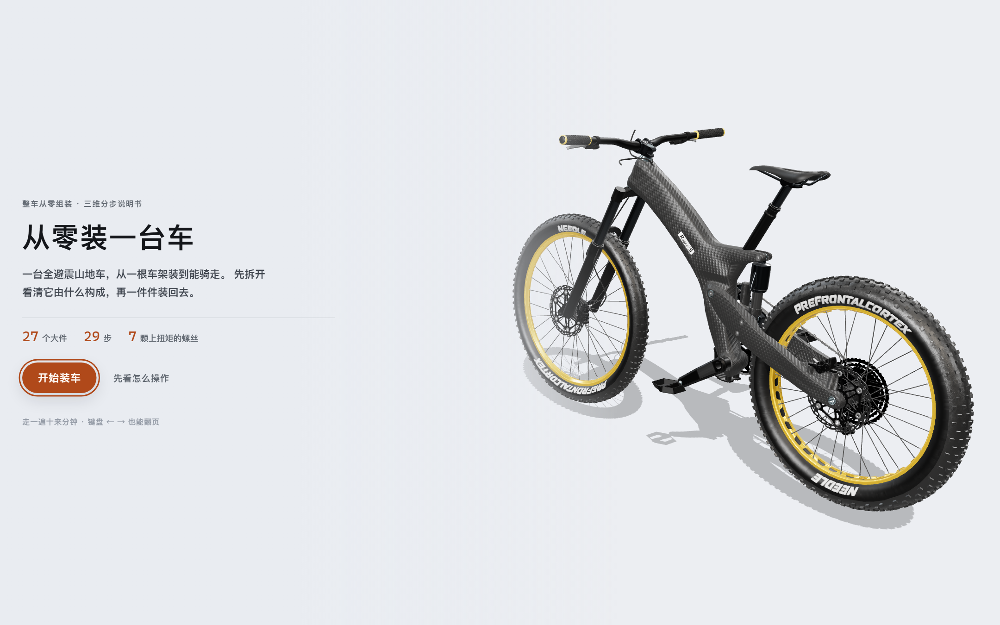
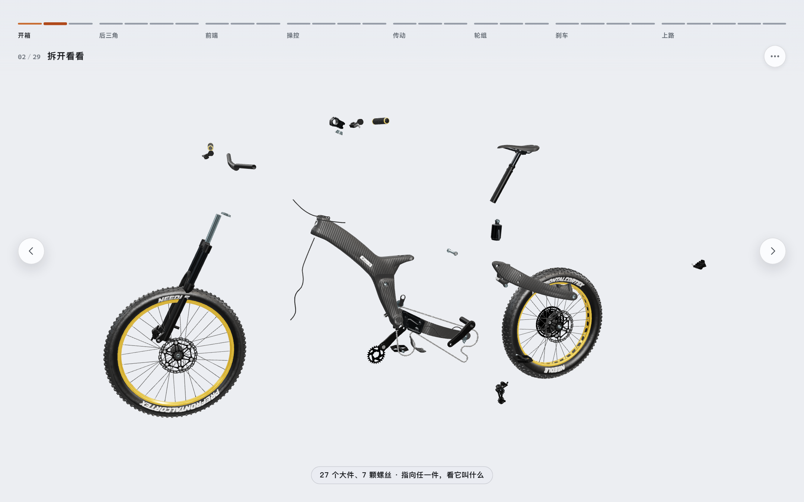
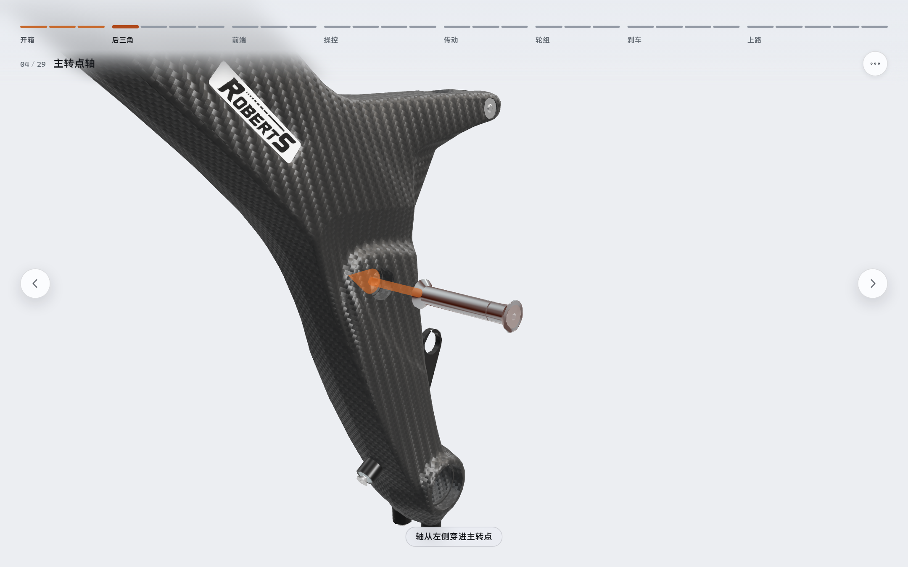
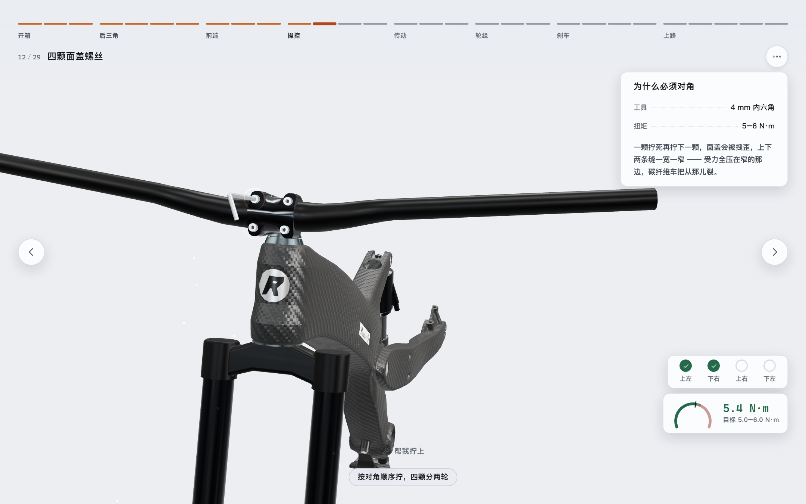
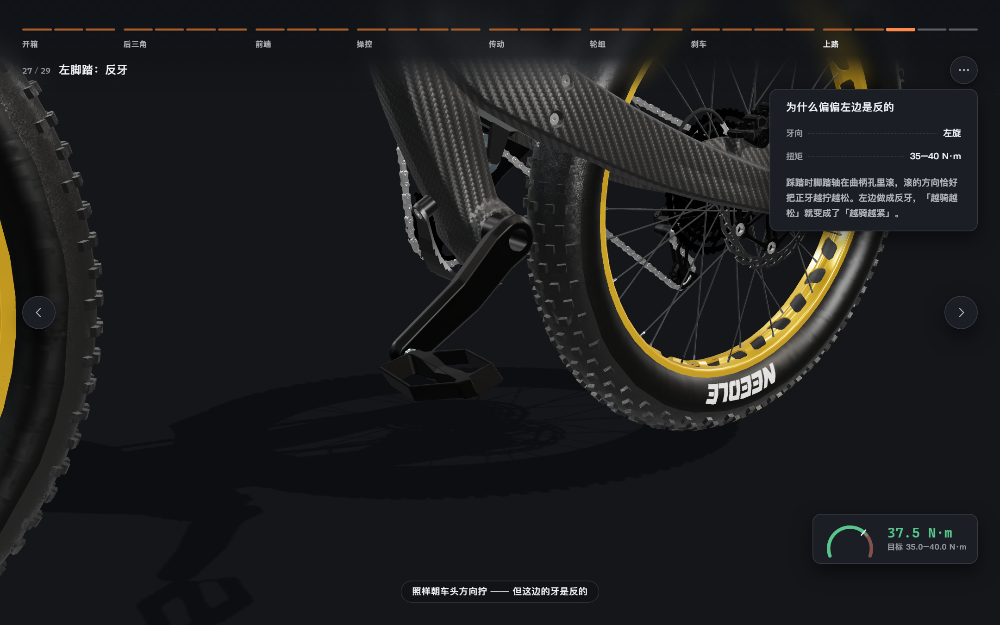
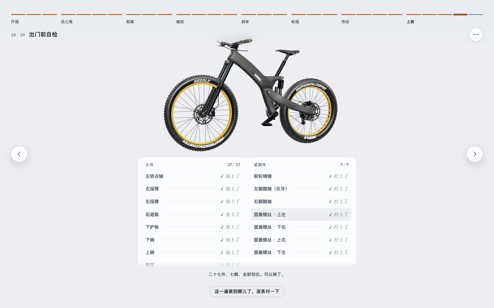
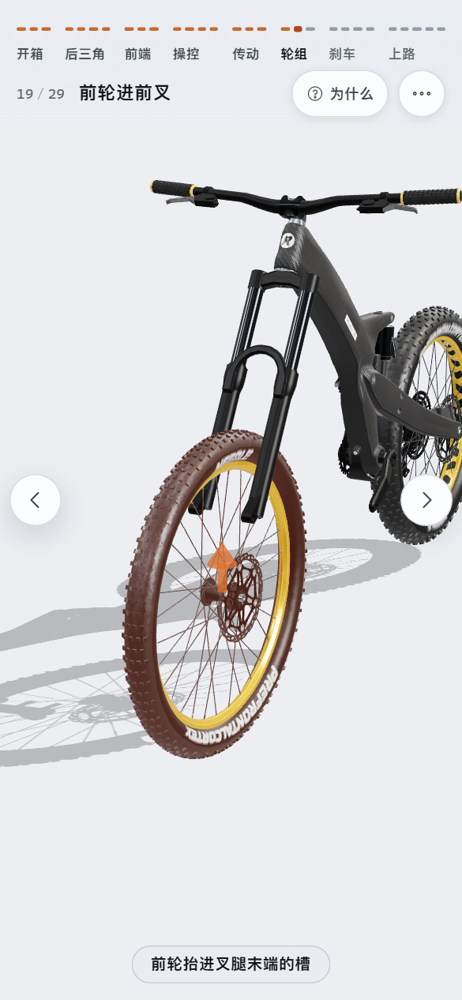

# 从零装一台车

**一台全避震山地车，从一根车架装到能骑走的三维分步说明书。**

二十七个大件、七颗螺丝，八章二十九步 —— 每一件都亲眼看着装上去。
给想弄明白「一台车到底由什么组成、为什么必须这么装」的人。

**▶ 打开看看：<https://build-bike.vercel.app>**

首屏要读一份 12 MB 的整车模型，第一次打开有十来秒加载条。需要 WebGL 2
（Chrome / Edge 111+、Safari 16.4+、Firefox 113+）。



## 它是怎么讲的

**先拆开给你看。** 第二步整台车摊开，按装配顺序**倒着**一层层剥 ——
最后装上的先飞出去，车架最后剩下，下一步「从一根车架开始」正好接住。
二十七件谁也不叠着谁，左右成对的那五组还各自往两边掰开，所以是真的数得出二十七件，
而不是一堆东西胡乱炸开。

**指到哪件，旁边就报哪件的名字。** 二十七个名字一起标出来是一屏浮字，一次只说一个才读得成。
除了首页那一步（它已经钉了四枚带说明的圆点），每一步都能指着问：
装好的报大件名，还没装的报它自己的名，指到底座就报车架。



**顺序不是编的。** 后三角、前端、操控、传动、轮组、刹车 ——
没压头碗前叉无处可穿，没有把立车把没有托座，没装曲柄脚踏拧不进去。

**镜头一路是连着的，而且只在该动的时候动。** 二十九步之间没有跳切：
换步时相机绕着主体转过去、等比推拉、两头都不带顿挫，一步的落点就是下一步该在的机位。
看不出来的位移直接落位，不做多余的动画。开箱那三步索性共用一个机位：
装好的、摊开的、只剩车架的，镜头不动，变的只有车。往回翻同样顺。

**近景要看得出这是车上的哪儿。** 每一步框住的是这一件从预备位扫到装配位的整段行程，
连同它周围那一小块车身，而这一件停在舞台中央。主转点轴只有一颗螺栓那么大，
镜头也不会贴到脸上去 —— 那样屏幕上只剩一片碳纤维编织纹。



**看懂优先于读懂。** 界面上常驻的文字只有两处：顶栏的步名，底部一行旁白。
其余交给动画。说明卡只出现在「物理原因看不见」的地方 —— 反牙、对角顺序、最小插入线。

**按一下，演一件。** 「下一步」在这一步还有活没干完时先演一件，不翻页：
两条摇臂按两下，四颗面盖螺丝按四下，做完再按一下才走。
一口气演完的话，四颗螺丝会在一两秒里连着转完 ——
而「对角、分两轮」正是那一步要看清的东西。

## 三处签名交互

**四颗面盖螺丝的对角顺序。** 一颗拧死再拧下一颗，面盖会被拽歪，上下缝一宽一窄，
碳纤维车把从窄的那边裂。每拧完一颗都要问一次「这颗是不是上一颗的对角」，
跳过会立刻收到提示，并计入结尾自检。



**左脚踏是反牙。** 允许你拧错 —— 往正牙方向拧满两圈才发涩、停住、回退半圈，
再告诉你真车上这两圈已经开始啃曲柄的铝螺纹。一上来就拦着不让拧，什么也学不到。



**拧到底那一下。** 按住螺栓绕圈拧，转一圈进一个螺距，转满就到底 —— 一声「咔」，
这颗就上好了。**没有扭矩读数，也没有「拧过头」**：那一套讲的是拧紧工艺，
而这一份要教的是「这一件怎么接上那一件」，却要占掉一屏最显眼的位置。
每过一牙的沙沙、到底那一记咔、零件坐实的闷响，都是按物理成因实时合成的，
一个音频文件都不载。

## 出门前自检

装完之后逐条对账：二十七个大件装没装、七颗紧固件拧到多少牛米。
每一行都能点回它所属的那一步 —— 一张只会说「还没装」的清单把人留在原地，
能点回去的清单才是「接下来做什么」。



## 手机与平板

**没有底部条。** 界面退到四周：顶上一行说走到哪了，两侧各一枚翻页（垂直居中、贴边），
右边一列放读数与「为什么」，底部一句旁白。中间整片留给车。

竖屏、横屏、平板各有一档版式：说明卡在窄屏收进顶栏那枚「为什么」，读数落到底部。
每一步的取景会把界面实际占掉的那几条边算进去 —— 右边那张说明卡摊开时，车会自己往左让。



键盘也能走完全程：方向键 ← → 翻页，Esc 逐层退出，进度轨整条只占一个 Tab 位、
进去之后用方向键在格子之间走。焦点圈与读屏播报都在。

## 在本地跑

需要 Node `^22.13 || >=24`。

```bash
npm install
```

```bash
npm run dev
```

打开 <http://localhost:5174>。其余命令与开发约定见 [docs/DEVELOPMENT.md](docs/DEVELOPMENT.md)。

## 已知限制

- 整车模型 12 MB 且未压缩，理由见 [DEVELOPMENT.md](docs/DEVELOPMENT.md#模型)。
- 螺纹连接只做了七处（面盖四颗、桶轴、左右脚踏轴）。
  其余二十七个大件走的是「推到位」这一种交互 —— 模型里没有它们各自的螺栓，不凭空造。
- 进度不存档：装一遍十来分钟，刷新即从头开始。
- 界面只有中文。

## 参与

- [CONTRIBUTING.md](CONTRIBUTING.md) —— 怎么改、提交前跑什么
- [CODE_OF_CONDUCT.md](CODE_OF_CONDUCT.md) —— 行为准则
- [SECURITY.md](SECURITY.md) —— 攻击面、什么算漏洞、怎么私密上报
- [COMMERCIAL.md](COMMERCIAL.md) —— 商业授权

订正工程数据（规格、螺距、装配顺序）尤其欢迎：这份清单里每一个数都可能错，
而错了的后果是有人照着它把车装坏。

## 许可

三层，各自不同：

| | 是什么 | 许可 |
|---|---|---|
| 代码 | `src/` `tools/` `index.html` 构建配置 | **AGPL-3.0** |
| 我做的内容 | 课程编排、文案、装配清单、程序化螺栓与工具几何、音效配方、设计令牌 | **CC BY-NC-SA 4.0** |
| 整车模型 | `public/models/CarbonFrameBike.glb` 与含它画面的截图 | **CC BY-SA 4.0**，第三方 |

代码是纯前端应用，AGPL 下**部署出去访问者就是接收者** —— 挂到网上供人访问，
就得把改动后的完整源码一并提供。内容层的 NC 是禁止商业使用。

**第三层不归我管。** 整车模型建模 Robert Schweier、实时化与动画
Felix Herbst / prefrontal cortex，详见 [assets/CREDITS.md](assets/CREDITS.md)。
我不是版权人、无权转授。要商用最干净的做法是换掉模型 ——
清单里所有几何量都写着节点名，改 `assets/bike.manifest.json` 即可。

细节与单独授权见 [COMMERCIAL.md](COMMERCIAL.md)。
